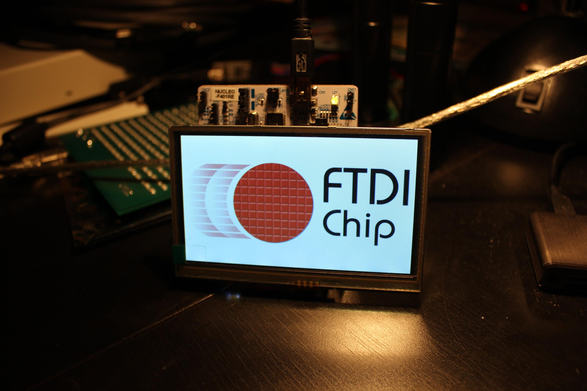
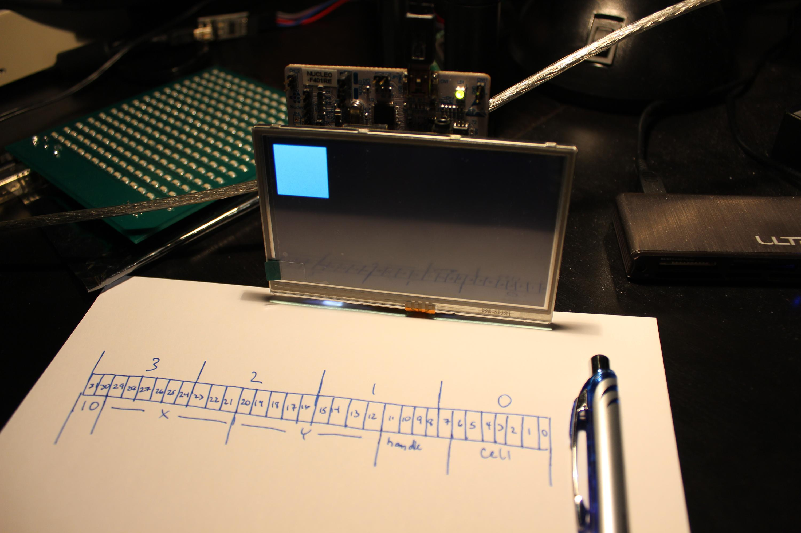
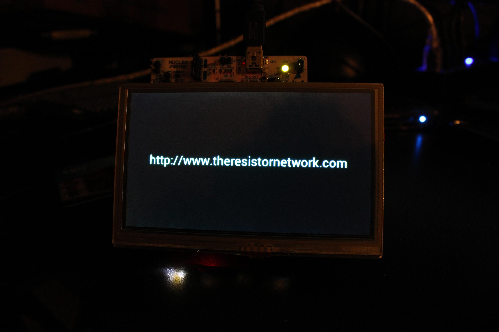

# u2048

## Overview

This project implements the popular 2048 game on an STM32F4 Nucleo board.

A Gameduino2 is used for UI.

## Pictures

### FTDI Logo

First command implemented. The FT800 has a built-in animated FTDI logo to use
as a sanity check.

### First Rectangle

I wrote a function to emit the required display list instructions to create a
rectangle from integer arguments.

### Rendered Game

Once I had rectangles, it was simple to render a basic game 2048 game board.

### Text Rendering

The FT800 has a builtin set of bitmap fonts. Some of them are anti-aliased so I
am taking advantage of those. This was my first test of their text rendering
system.

